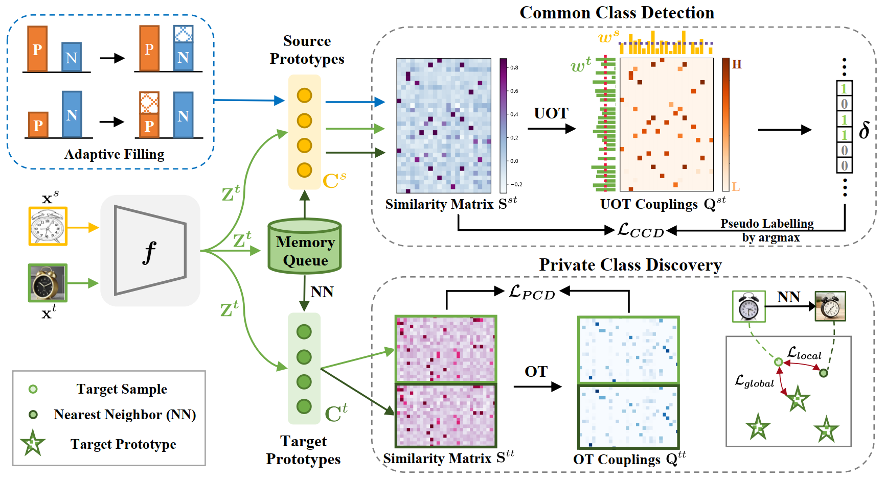

# [NeurIPS 2022 Spotlight] Unified Optimal Transport Framework for Universal Domain Adaptation

Code release for **Unified Optimal Transport Framework for Universal Domain Adaptation (NeurIPS 2022 Spotlight)**.

[[paper]](https://arxiv.org/abs/2210.17067) 
<!-- [[poster]]() [[video]]() [[slides]]() [[知乎]]() -->



## Requirements
* Python 3.7+
* PyTorch 1.8.0
* GPU Memory 12 GB

To install requirements:

```
pip install -r requirements.txt
```

## Preparation
* Download the dataset: [Office31](https://faculty.cc.gatech.edu/~judy/domainadapt/), [OfficeHome](https://www.hemanthdv.org/officeHomeDataset.html), [VisDA](https://github.com/VisionLearningGroup/taskcv-2017-public/tree/master/classification) and [DomainNet (real, painting and sketch)](http://ai.bu.edu/M3SDA/).
* Prepare dataset in data directory as follows
    ```
    /path/to/your/dataset/images/amazon/      # Office
    /path/to/your/dataset/RealWorld/          # OfficeHome 
    /path/to/your/dataset/train/              # VisDA synthetic images
    /path/to/your/dataset/test/               # VisDA real images
    /path/to/your/dataset/sketch/             # DomainNet
    ```

* For OfficeHome dataset, make sure that your folder name is `RealWorld` instead of `Real World`.
* Modify `root_path` with `/path/to/your/dataset/` in config files `./config/<dataset>-config.yaml`.
* Make a log directory by ```mkdir ./log```.
* Make a model directory by ```mkdir ./model```. Download ImageNet pretrained model from [Google Drive](https://drive.google.com/file/d/1wWsZYeQ3b1Zd5R5TRmVeAxYlEU3KHuy2/view?usp=sharing), then put the downloaded model into ```./model```. 

## Getting started
* Train with command line (take `office` for example)
    ```
    python main.py --gpu 0 --exp office31 --dataset office31 --source amazon --target dslr
    ```

* Train with script

    Modify `./config/<dataset>.sh`:
    * delete the lines which begin with `#SBATCH`
    * specify `$CUDA_VISIBLE_DEVICES`
    
    then
    ```
    cd ./script
    sh office31.sh          # or officehome/visda/domainnet
    ```

* Train with **Slurm** script

    Modify `./config/<dataset>.sh`:
    * `#SBATCH --mail-user=YOU@MAIL.COM`
    * `#SBATCH -p YOUR_partition` 
    
    then
    ```
    cd ./script
    mkdir output
    sbatch office31.sh      # or officehome/visda/domainnet
    ```

* Monitor (TensorBoard required)
    ```
    tensorboard --logdir=./log --port xxxx
    ```

* Test with command line (take `office` for example)
    ```
    python eval.py --gpu 0 --dataset office31 --source amazon --target dslr --model_path /path/to/your/model/final.pkl
    ```

## Checkpoints
We provide the checkpoints for Office, OfficeHome, VisDA and DomainNet at [Google Drive](https://drive.google.com/drive/folders/1TMz7lX9Seu3-IFCco2aiyLmc0sVj2Lps?usp=sharing).

## Citation
If you find this repository useful in your research, please consider citing:

```
@inproceedings{
chang2022unified,
title={Unified Optimal Transport Framework for Universal Domain Adaptation},
author={Wanxing Chang and Ye Shi and Hoang Duong Tuan and Jingya Wang},
booktitle={Advances in Neural Information Processing Systems},
editor={Alice H. Oh and Alekh Agarwal and Danielle Belgrave and Kyunghyun Cho},
year={2022},
url={https://openreview.net/forum?id=RTan64GlCLV}
}

